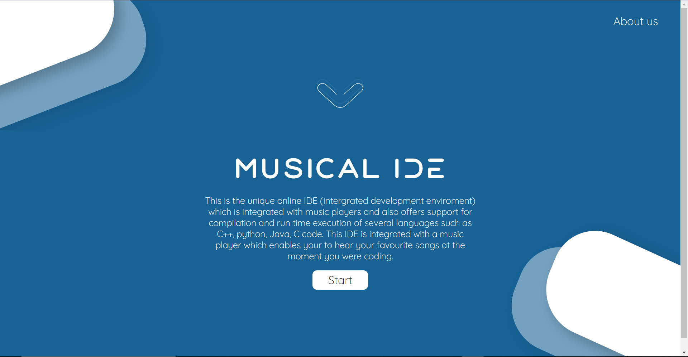
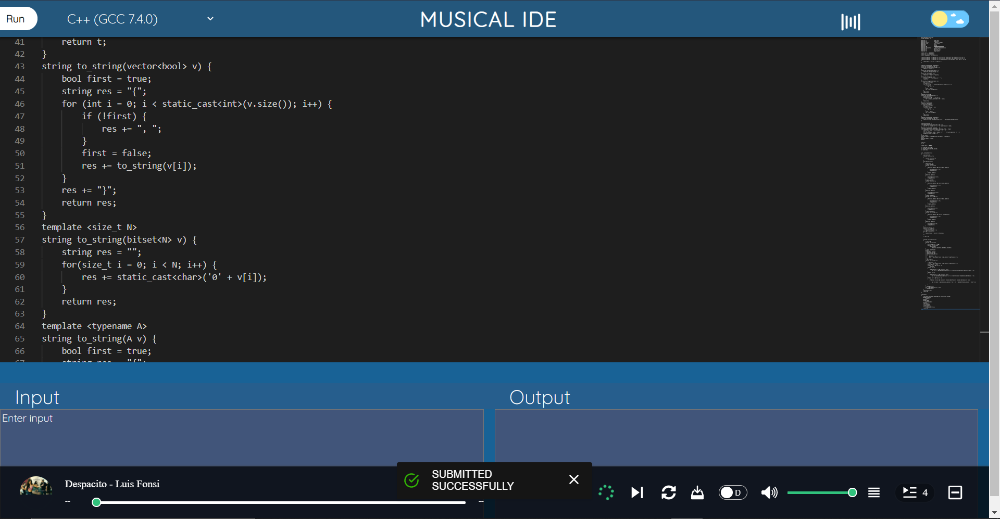
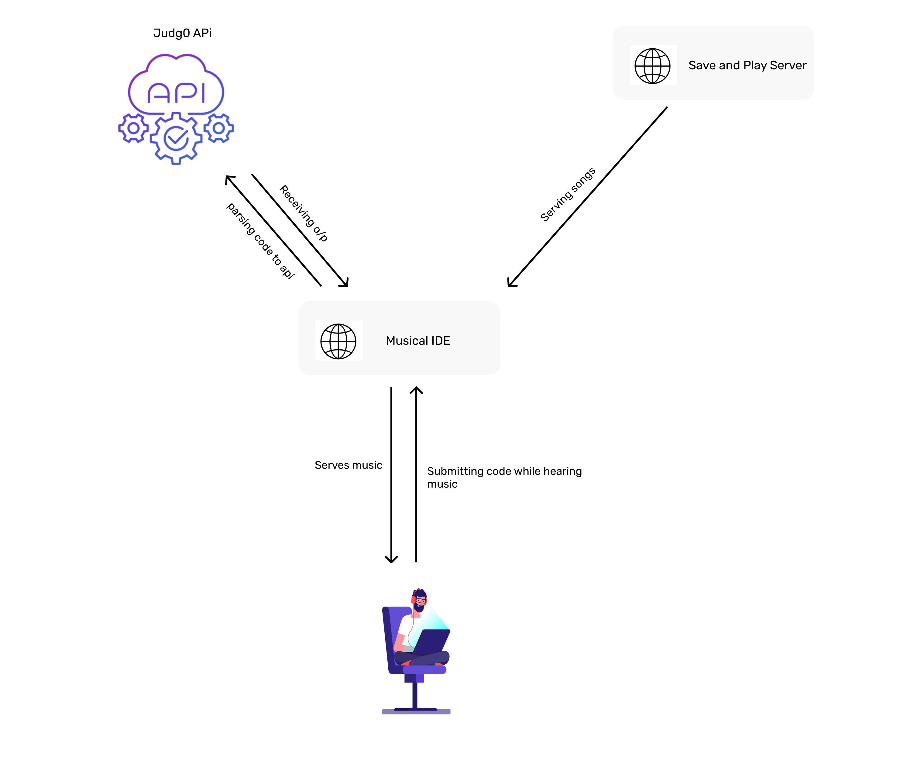

 

 
 # What it is ? 🤔
 
 #### 📌 This is the unique online IDE (intergrated development enviroment) integrated with music players.
 
 #### 📌 It offers support for compilation and run time execution of several languages such as C++, python, Java, C code. 

#### 📌 This IDE is integrated with a music player which enables your to hear your favourite songs at the moment you were coding.

<h1 align="center"> Sneak 📷 Peak </h1> 

  
 

 

### 👨‍💻 Working 

 

 
 
 PS: App consumes music from here: [music server](https://github.com/nlok5923/S.A.P-save-and-play)
<!-- 
 -->

<!--  -->
 - Made with 💻 by [@nlok5923](https://github.com/nlok5923)
 - Design Credits 🎨 : [@solankidivyam](https://github.com/solankidivyam) 
